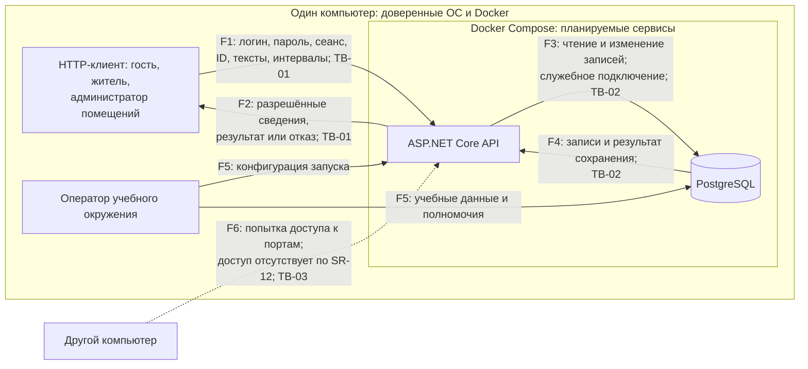

# Модель угроз WiseDubs

## Модель продукта и статус

WiseDubs объединяет безвозмездную передачу вещей и бронирование общих комнат общежития. [Паспорт](PROJECT.md) задаёт роли, границу и сценарии; [требования](SECURITY_REQUIREMENTS.md) — защитные свойства и критерии будущей приёмки. Эта модель — результат S03, доработанный как вход к S04.

**Что уже существует:** в репозитории оформлены проектные документы. Запускаемая техническая основа и фактические результаты проверок защитных свойств не представлены.

**Что планируется:** HTTP API на ASP.NET Core и PostgreSQL как отдельные сервисы Docker Compose на одном компьютере, выполнение сценариев через локальный HTTP-клиент. Почтового компонента, подтверждения email, внешней модерации, бота и файловых загрузок в этой границе нет. API публикуется на `127.0.0.1`; порт БД на хост не публикуется. Наличие ограничений в документах не доказывает их выполнение.

**Существенные допущения:**

- Владелец компьютера, ОС и Docker — доверенное окружение. Оператор готовит конфигурацию и учебные данные, выдаёт и отзывает роль вне пользовательского API. Администратор помещений — роль приложения с доступом к справочнику, а не оператор компьютера.
- Локальный клиент может отправлять произвольные запросы, изменять ID и поля, повторять и параллельно выполнять операции. Наличие сеанса не делает ввод доверенным; предполагается также ошибочный ввод и конкуренция обычных пользователей без злого умысла.
- Данные вымышленные. Email — уникальный логин без проверки владельца адреса или проживания. Дневная квота относится к аккаунту: разные аккаунты не объединяются в одну личность. Контакт автора и место передачи намеренно доступны любому вошедшему пользователю.
- Сетевые соединения между локальными компонентами не шифруются. HTTP здесь не является разрешением на доступ по LAN или из Интернета. Ошибка публикации порта рассматривается как сценарий нарушения локальной границы.
- Сроки и сравнение дат определяются сервером; часам клиента не доверяют. Дневной счётчик использует дату начала в `Europe/Moscow`, а не дату отправки запроса и не все дни, затронутые интервалом.

## Архитектурный вид

Это единственный актуальный архитектурный вид. Все серверные компоненты и их поведение планируемые. Схема показывает логические потоки данных и область размещения; точные маршруты API, формат сеанса и механизмы хранения ещё не выбраны.

Сплошные стрелки — планируемые рабочие потоки, пунктирная — попытка внешнего доступа для анализа T-14, а не разрешённое взаимодействие. Для PostgreSQL действует та же граница TB-03, хотя дополнительная стрелка на схеме не дублируется.

| Поток | Данные и решение |
| --- | --- |
| F1, клиент → API | Email, имя, пароль при регистрации; email и пароль при входе; подтверждение сеанса; ID объявлений, резервов, комнат и броней; названия, описания, контакты, место передачи, цель и время. API устанавливает текущего пользователя и полномочия, проверяет ввод, принадлежность, состояние, пересечения и дневную квоту. Присланные поля автора, владельца и роли не устанавливают права. |
| F2, API → клиент | При входе — подтверждение нового сеанса; далее только разрешённые поля объявлений, резервов, комнат и броней, результат операции или контролируемая ошибка. Здесь важны фильтрация вложенных данных, состояние резерва и отсутствие секретов в ошибках. |
| F3, API → БД | Чтение аккаунтов, сведений о сеансах и полномочиях; создание и изменение объявлений, резервов, комнат и броней, обращение к истории. Служебное подключение не передаётся пользователю. Гарантии совместных и конкурентных изменений предстоит выбрать на S04. |
| F4, БД → API | Сохранённые данные, результаты проверки и сохранения либо отказ. API должен сохранить согласованность операции при конфликте или сбое и не выдать лишние поля из полученных записей. |
| F5, оператор → окружение | Настройки публикации портов и подключения, подготовка вымышленных данных, выдача и отзыв административных прав. Эти действия вне пользовательского API; конкретный инструмент не выбран. |
| F6, внешний компьютер → порты | Попытка соединения с API или БД через сетевой адрес компьютера. В рабочей конфигурации соединение не должно устанавливаться. При ошибке F5 появляется незапланированная поверхность доступа. |

Клиент обращается по HTTP к loopback-адресу с опубликованным портом. API обращается к PostgreSQL по имени сервиса и внутреннему порту, например `db:5432`: `localhost` внутри контейнера обозначает сам контейнер. Оба соединения сетевые, но остаются на одном компьютере. Интернет может потребоваться при первоначальном получении зависимостей и образов; внешние прикладные вызовы для регистрации, входа и предметных операций не нужны. Формирование конфигурации и проверка автономного запуска ещё предстоят.

### Точки входа

Названия обозначают операции, а не утверждённые URL или методы HTTP.

| Операции | Вход и затронутое состояние |
| --- | --- |
| Регистрация и вход | Email, имя, пароль; создаются аккаунт или сеанс, учитываются лимиты попыток. До входа других пользовательских операций нет. |
| Выход и защищённое чтение | Подтверждение сеанса, ID или параметры списка; прекращается текущий сеанс либо выдаются разрешённые сведения. |
| Создание, правка и снятие объявления | ID и тексты, контакт и место передачи; изменяются объявление, его состояние и при снятии активный резерв. |
| Резервирование и отмена резерва | ID объявления или резерва, отдельный контакт получателя; устанавливается или прекращается связь с одним получателем. |
| Каталог, занятость и свои брони | ID комнаты или брони, параметры чтения; общее расписание отделено от сведений владельца и истории. |
| Создание, перенос и отмена брони | ID, начало с часовым поясом, длительность или конец и цель; меняются интервал, состояние, занятость и подсчёт дневной квоты. Форма передачи длительности ещё не выбрана. |
| Добавление и удаление комнаты | Название, корпус и ID; изменяется справочник с учётом связанных броней и истории. Нужна действующая административная роль. |
| Подготовка окружения | Конфигурация, вымышленные данные и изменение роли оператором; влияет на доступность сервисов и полномочия. Это служебный вход F5. |

## Границы доверия

| ID и стороны | Что пересекает | Почему требуется проверка |
| --- | --- | --- |
| TB-01: HTTP-клиент ↔ API | F1: учётные данные, сеанс, ID, тексты и команды; F2: разрешённые результаты и поля | Клиент управляет запросом и его порядком. Локальность, скрытая кнопка и правильный формат ID не доказывают подлинность, право на объект или допустимость состояния. В обратном направлении нельзя выдавать все поля записи одному лишь факту входа. |
| TB-02: API ↔ PostgreSQL | F3–F4: запросы и результаты через служебное подключение, сохранённое состояние | Прикладной пользователь не имеет прав служебного подключения. Его строки не должны превращаться в команды БД; чтение и сохранение не должны обходить принадлежность, квоту и инварианты. Две отдельные проверки до записи не доказывают согласованность конкурентных изменений. |
| TB-03: локальное окружение ↔ другие компьютеры | F6: попытки доступа к портам, доступность которых задаётся F5 | Доверие к одному компьютеру не распространяется на другие узлы сети. Нельзя публиковать HTTP API на внешнем интерфейсе или открывать БД, опираясь на предполагаемую локальность. В штатной конфигурации рабочие данные эту границу не пересекают. |

Выдача и отзыв роли оператором не являются пользовательскими полномочиями. F5 — доверенный служебный источник, который может содержать ошибку конфигурации; T-14 учитывает такую ошибку. Захват ОС, чтение её администратором файлов/памяти и компрометация Docker вне гарантируемой области, поэтому отдельный набор защитных требований против владельца компьютера не вводится.

## Значимые объекты и свойства

Полное описание данных и последствий — [раздел 5 паспорта](PROJECT.md#5-значимые-данные-и-другие-объекты). Для обхода модели важны:

- подлинность аккаунта и ограниченный срок сеанса; сохранность существующего аккаунта при регистрации;
- принадлежность объявлений, резервов и броней, актуальные административные права;
- закрытость получателя резерва, владельца и цели чужой брони, снятого объявления и секретов;
- один получатель вещи, согласованность снятия и резерва, отсутствие пересекающихся броней, сохранение прежней записи при отказе переноса;
- дневной предел, сохранность справочника и истории, возможность продолжить допустимую работу после временного ограничения;
- отсутствие пользовательского пути к БД в обход API и сохранение локальной доступности сервисов.

## Угрозы

Все записи ниже — релевантные потенциальные сценарии, а не обнаруженные дефекты реализации. STRIDE использована как вопросник к потокам и операциям: подмена субъекта, изменение, раскрытие, отказ и повышение полномочий дали приведённые сценарии. Для отрицания действий отдельной гарантии подотчётности в учебном ядре нет; это ограничение модели, а не доказательство отсутствия такого риска. Исчерпывающий каталог атак не заявляется.

Шкала относительная: **высокий** — нарушение ключевых прав, закрытых данных или согласованности сквозного сценария через доступный вход; **средний** — значимое нарушение с более узким результатом или дополнительным условием (массовые попытки, служебное удаление, ошибка публикации). Оценка учитывает предпосылки, а не только тяжесть; она не является вероятностью, измеренной на работающей системе.

### T-01. Предметный доступ без входа

**Сценарий.** Гость напрямую запрашивает список или карточку объявления, расписание либо создание брони без сеанса. Если API принимает такой запрос или доверяет переданному ID пользователя, гость получает закрытые данные и выполняет действие от произвольного имени.

**Нарушение и последствие.** Подлинность и допуск: раскрываются контакты или планы, создаётся ложная договорённость.

**Вход:** TB-01, F1–F2; защищённое чтение и предметные изменения. **SR:** [SR-01](SECURITY_REQUIREMENTS.md#sr-01-допуск-после-входа-и-сохранность-аккаунта).

**Приоритет: высокий.** Достаточно прямого локального запроса; затрагиваются оба основных сценария. Регистрация сама по себе не должна открывать предметный доступ до входа.

### T-02. Перезапись аккаунта повторной регистрацией

**Сценарий.** Локальный пользователь регистрирует занятый email с другим паролем или вариантом регистра/пробелов. При обновлении существующей записи вместо отказа или при конкурентном создании двух аккаунтов он подменяет сведения владельца либо разрушает однозначность логина.

**Нарушение и последствие.** Целостность учётной записи и идентификация: владелец теряет вход или объекты связываются не с тем аккаунтом.

**Вход:** TB-01 и TB-02, F1 и F3–F4; регистрация. **SR:** [SR-01](SECURITY_REQUIREMENTS.md#sr-01-допуск-после-входа-и-сохранность-аккаунта), [SR-09](SECURITY_REQUIREMENTS.md#sr-09-безопасная-обработка-ввода-и-отказов).

**Приоритет: средний.** Требуются занятый логин и отдельное нарушение обработки дубликата или конкуренции регистрации. Это важный, но более узкий путь, чем общий обход допуска и сеанса; его не заменяет проверка формата email.

### T-03. Использование поддельного или прекращённого сеанса

**Сценарий.** Пользователь меняет подтверждение сеанса либо сохраняет его перед выходом и продолжает предъявлять после выхода или семи дней. Если API принимает такое значение либо продлевает срок каждым обращением, запросы проходят как действия владельца вне разрешённого периода.

**Нарушение и последствие.** Подлинность и ограничение доступа по времени: прежний доступ позволяет читать данные, резервировать вещи и менять брони после прекращения сеанса.

**Вход:** TB-01, F1; все защищённые операции и выход. **SR:** [SR-02](SECURITY_REQUIREMENTS.md#sr-02-ограниченный-жизненный-цикл-сеанса).

**Приоритет: высокий.** Повторное предъявление легко воспроизвести, затронуты все предметные операции. Способ выдачи и проверки сеанса пока не выбран.

### T-04. Изменение чужой договорённости по ID

**Сценарий.** Пользователь B подставляет ID объявления, резерва или брони A в снятие, правку, отмену или перенос либо передаёт A как владельца новой записи. При проверке только существования объекта или принятии владельца из запроса B меняет чужую договорённость.

**Нарушение и последствие.** Авторизация и целостность: чужая вещь снята, резерв прекращён или забронированное время потеряно. Администратор помещений может попытаться выполнить тот же запрос, необоснованно распространив свою роль на чужие объекты.

**Вход:** TB-01, F1 и F3; изменения объявлений, резервов и броней. **SR:** [SR-03](SECURITY_REQUIREMENTS.md#sr-03-полномочия-и-принадлежность-объектов).

**Приоритет: высокий.** Знание ID и один прямой запрос достаточны для попытки; нарушение разрушает основные договорённости.

### T-05. Неправомерное управление справочником

**Сценарий.** Обычный пользователь передаёт административную роль при регистрации или напрямую вызывает добавление/удаление комнаты. Прежний администратор делает такой запрос после отзыва роли с ещё действующим сеансом. Если API принимает поле роли или устаревшее право, справочник меняется без полномочий.

**Нарушение и последствие.** Авторизация и целостность полномочий: появляются ложные комнаты либо удаляются записи, которые пользователь не вправе менять.

**Вход:** TB-01, F1; регистрация и операции справочника. Источник актуальной роли — служебное изменение F5 и данные F4. **SR:** [SR-03](SECURITY_REQUIREMENTS.md#sr-03-полномочия-и-принадлежность-объектов).

**Приоритет: высокий.** Административные операции технически достижимы через тот же API, а отзыв должен работать с ранее выданным сеансом. Ограниченная роль администратора не даёт прав оператора.

### T-06. Выдача закрытых полей и старых связей

**Сценарий.** Третий пользователь, включая администратора, запрашивает известный ID брони или получает вложенный профиль получателя в объявлении. Автор повторно читает старый резерв после его прекращения. При выдаче всей записи или применении фильтра только к списку раскрываются закрытые поля либо бывший получатель.

**Нарушение и последствие.** Конфиденциальность: чужие контакт, интересы, владелец и цель брони раскрыты; снятое объявление продолжает выдаваться постороннему, email входа публикуется автоматически.

**Вход:** TB-01, F2 после F4; списки, карточки, запросы по ID, история и ответы изменений. **SR:** [SR-04](SECURITY_REQUIREMENTS.md#sr-04-ограничение-раскрытия-данных).

**Приоритет: высокий.** Обычного разрешённого чтения достаточно для попытки, а видимость меняется после отмены/снятия. Разрешённая публикация контакта автора не разрешает публикацию всех связанных данных.

### T-07. Конкурентные операции нарушают резерв вещи

**Сценарий.** Два получателя одновременно резервируют свободную вещь. Автор параллельно снимает или редактирует предложение, либо получатель отменяет резерв одновременно со снятием. При раздельных проверках и записях оба запроса получают несовместимый успех, снятая вещь становится свободной или условия меняются после резерва.

**Нарушение и последствие.** Целостность состояния: вещь обещана нескольким людям, сохраняется резерв снятого объявления или договорённость меняется после закрепления получателя. Сбой между связанными изменениями может дать тот же результат.

**Вход:** TB-01 и TB-02, F1 и F3–F4; резервирование, правка, снятие, отмена. **SR:** [SR-05](SECURITY_REQUIREMENTS.md#sr-05-целостность-объявления-и-резерва), [SR-09](SECURITY_REQUIREMENTS.md#sr-09-безопасная-обработка-ввода-и-отказов).

**Приоритет: высокий.** Два обычных корректных запроса могут нарушить ключевой результат передачи вещи без злого умысла.

### T-08. Пересечение броней и потеря исходного интервала

**Сценарий.** Пользователи одновременно создают или переносят брони в пересекающееся время одной комнаты; отправляют эквивалентное время в разных поясах либо недопустимый интервал. При несогласованной проверке занятости подтверждаются обе брони; при снятии старого интервала до успешного переноса конфликт или сбой лишает владельца прежнего времени.

**Нарушение и последствие.** Целостность расписания: несовместимые обещания доступа к комнате, занятие недопустимого времени или потеря действующей брони.

**Вход:** TB-01 и TB-02, F1 и F3–F4; создание и перенос брони. **SR:** [SR-06](SECURITY_REQUIREMENTS.md#sr-06-достоверность-занятости-комнат), [SR-09](SECURITY_REQUIREMENTS.md#sr-09-безопасная-обработка-ввода-и-отказов).

**Приоритет: высокий.** Конкуренция естественна для общего ресурса; одного корректного последовательного примера недостаточно для гарантии. Соседние полуоткрытые интервалы должны оставаться допустимыми.

### T-09. Обход дневной квоты аккаунта

**Сценарий.** Пользователь с двумя бронями на дату начала одновременно создаёт ещё две в разных комнатах либо переносит записи с других дат. При подсчёте по комнате, дате запроса, часовому поясу клиента или только будущим записям он получает больше трёх на день; удаление комнаты с прошедшей бронью также может ошибочно уменьшить счётчик.

**Нарушение и последствие.** Целостность квоты и допустимая доля расписания: один аккаунт занимает больше разрешённого, а неуспешный перенос может частично освободить прежнюю дату.

**Вход:** TB-01 и TB-02, F1 и F3–F4; создание, перенос, отмена и подсчёт по истории. **SR:** [SR-13](SECURITY_REQUIREMENTS.md#sr-13-дневной-предел-бронирований), [SR-09](SECURITY_REQUIREMENTS.md#sr-09-безопасная-обработка-ввода-и-отказов).

**Приоритет: средний.** Нужны несколько броней или конкурентные изменения; ущерб — превышение доли одного аккаунта, а не две подтверждённые брони одного интервала. Неотменённая прошедшая запись учитывается; отменённая освобождает место. Квота не защищает от нескольких аккаунтов.

### T-10. Удаление комнаты разрушает брони или историю

**Сценарий.** Администратор удаляет комнату одновременно с созданием или переносом брони в неё. При устаревшей проверке комната исчезает после подтверждения брони. При удалении комнаты вместе со связанными записями исчезают сведения о прошедших/отменённых бронях владельца.

**Нарушение и последствие.** Целостность справочника и сохранность истории: пользователь остаётся с бронью несуществующей комнаты либо теряет сведения о своих договорённостях; отказ переноса может оставить неполную запись.

**Вход:** TB-01 и TB-02, F1 и F3–F4; удаление комнаты, создание/перенос и чтение истории. **SR:** [SR-07](SECURITY_REQUIREMENTS.md#sr-07-сохранность-справочника-и-истории), [SR-09](SECURITY_REQUIREMENTS.md#sr-09-безопасная-обработка-ввода-и-отказов).

**Приоритет: средний.** Требуется служебное удаление с конкурирующей бронью либо изменение связанных исторических записей. Операция реже основного бронирования, но её последствия требуют явного рассмотрения на S04.

### T-11. Раскрытие пароля, сеанса или конфигурации

**Сценарий.** Ответ API или диагностический журнал сохраняет пароль, действующее подтверждение сеанса либо строку подключения с секретом; команда публикует такой журнал или конфигурацию. Получатель материала использует секрет для чужого входа или прямого доступа к данным. Сохранение открытого/обратимого пароля делает чтение его записи источником того же секрета.

**Нарушение и последствие.** Конфиденциальность учётных данных: захват аккаунта или обход API. Ошибка запроса/БД может раскрыть стек и секреты вместе с диагностикой.

**Вход:** F2, F3–F5, TB-01 и TB-02; вход, обработка ошибок, хранение учётных данных и подготовка публичных материалов. **SR:** [SR-08](SECURITY_REQUIREMENTS.md#sr-08-защита-учётных-данных-и-секретов), [SR-09](SECURITY_REQUIREMENTS.md#sr-09-безопасная-обработка-ввода-и-отказов).

**Приоритет: высокий.** Секрет даёт повторно используемый доступ, а логирование запросов и публикация учебных примеров реалистичны даже для локального продукта. Доверенный оператор вправе видеть окружение, но это не разрешает публикацию секретов или выдачу их пользователям API.

### T-12. Пользовательский текст становится командой

**Сценарий.** Вошедший пользователь помещает SQL-фрагмент в название, описание, контакт или цель брони. Если сервер строит исполняемый запрос из строки, служебное подключение выполняет изменение чужих записей. Некорректный запрос или сбой выполнения между связанными записями может оставить частичное изменение вместо полного отказа.

**Нарушение и последствие.** Целостность и разделение данных/команд: ввод повреждает аккаунты, предложения или расписание за пределами предметной операции.

**Вход:** TB-01 и TB-02, F1 и F3–F4; текстовые поля и операции сохранения. **SR:** [SR-09](SECURITY_REQUIREMENTS.md#sr-09-безопасная-обработка-ввода-и-отказов).

**Приоритет: высокий.** Тексты входят в оба сценария; интерпретация строки с полномочиями подключения может повредить много объектов. Конкретный способ обращения к БД пока не выбран, поэтому исключение сценария не основано на установленной гарантии.

### T-13. Массовые попытки обходят временные пределы

**Сценарий.** Локальный пользователь скриптом перебирает пароль или массово регистрирует аккаунты, меняя регистр/пробелы email и присылая поддельный IP. При неедином или неконкурентном учёте он превышает предел; при учёте уже отклонённых запросов продлевает блокировку общему IP локальных клиентов.

**Нарушение и последствие.** Ограничение попыток и доступность входа: подбор упрощается, расходуются ресурсы или допустимая работа не восстанавливается после паузы.

**Вход:** TB-01, F1; вход и регистрация, параметры источника запроса. **SR:** [SR-10](SECURITY_REQUIREMENTS.md#sr-10-ограничение-массовых-попыток).

**Приоритет: средний.** Нужны многократные запросы из локального окружения; публичного интернет-входа в целевой границе нет. Общий IP остаётся существенным для учебной проверки, а квота одного аккаунта не ограничивает создание других аккаунтов.

### T-14. Локальные сервисы опубликованы во внешнюю сеть

**Сценарий.** При подготовке Compose оператор публикует API на всех интерфейсах хоста либо публикует порт БД. Другой компьютер в сети получает путь к HTTP API, а при доступных учётных данных БД — к записям в обход прикладных проверок.

**Нарушение и последствие.** Локальная граница: поверхность доступа выходит за один компьютер, учётные данные и операции оказываются в окружении без заявленной защиты сетевой передачи.

**Вход:** F5–F6, TB-03; конфигурация публикации и попытки соединения с API/БД. **SR:** [SR-12](SECURITY_REQUIREMENTS.md#sr-12-локальная-доступность-сервисов).

**Приоритет: средний.** Необходима ошибка конфигурации; в планируемой топологии этот путь запрещён. При обнаружении фактической внешней доступности оценка и граница должны пересматриваться немедленно. Защита от сетевого перехвата при удалённом размещении в текущую версию не переносится.

## Приоритетный набор

Для S04 выбран набор **T-01, T-03, T-04, T-05, T-06, T-07, T-08, T-11, T-12**. Он охватывает допуск и срок доступа, принадлежность и административные полномочия, меняющуюся приватность, согласованность каждого из двух сквозных сценариев и использование секретов/пользовательского ввода. Каждый сценарий затрагивает самостоятельное значимое свойство; объединять их только ради числа записей или исключать часть ради уменьшения будущей работы не следует.

Девять выбранных угроз превышают учебный ориентир 3–5: у продукта два различных изменяемых ресурса, отдельное управление справочником, закрытые поля и жизненный цикл сеанса. Одно решение S04 может связать несколько T и SR; отдельное D на каждую запись не требуется. Средние угрозы также релевантны и связаны с требованиями: более узкий эффект или дополнительное условие объясняет их относительное место, но не освобождает от выполнения SR.

## Ограничения и дальнейшая актуализация

- Квота по аккаунту и дате начала не гарантирует доступность комнат каждому жителю. Несколько аккаунтов, брони на разные будущие даты и интервал из предыдущего дня могут занимать время без нарушения SR-13. Подтверждение личности, ограничение горизонта и квота по каждому затронутому дню в эту версию не включены.
- Любой вошедший локальный пользователь видит контакт автора и место передачи; принадлежность к общежитию не проверяется. Ранее полученные данные не отзываются, когда API прекращает выдачу. Сроки физического хранения/удаления и отдельная гарантия подотчётности не определены.
- Платежи, фото, бот, внешняя модерация и почтовая доставка не входят в модель, потому что их функций и потоков в выбранной границе нет. Захват доверенного компьютера и промышленная доступность также не обещаются. Это причины ограничения области, а не утверждения о невозможности угроз при расширении.
- SR-11 выведен из границы и не используется для связей. Локальность не устраняет угрозы произвольных запросов, раскрытия через ответы или конкурентных изменений.

Связи каждой T с действующими SR определены. На S04 предстоит выбрать места и механизмы обеспечения свойств, связать весь приоритетный набор с D и будущими проверками, учитывая границы критериев SR. На S03 окончательные D, реализованные меры и выполненные испытания не заявляются.

Модель пересматривается при изменении интерфейса, роли, полей ответа, состояний, правил времени/квоты, служебных операций, размещения или интеграций. Выбор сеансов, обработки SQL, хранения истории и гарантий конкуренции может уточнить предпосылки и приоритеты. ID сохраняется, пока смысл угрозы прежний; для нового сценария выделяется новый ID. Появление внешнего доступа требует пересмотра сетевых угроз и прежнего SR-11.
